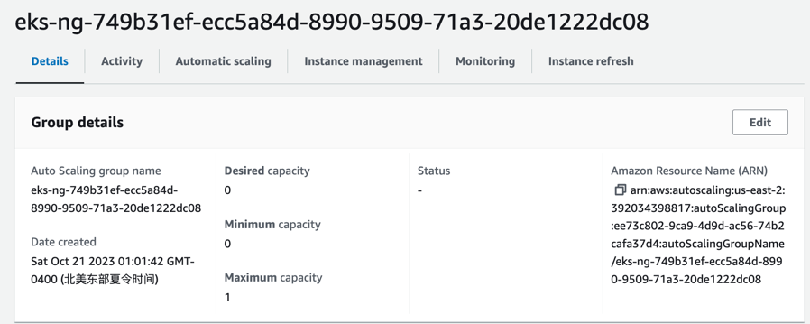

# e6156-pet-adoption
pet adoption microservice

### Dockerization
```shell
# build important: ec2 is amd64 while apple silicon is arm64
docker build --no-cache --platform linux/amd64 -t yuhanxia99/pet-adoption .  
# launch container using image
docker run -p 8011:8011 yuhanxia99/pet-adoption
# push
docker push yuhanxia99/pet-adoption
```
### Create Amazon EKS cluster and nodes
```shell
# managed node linux, not fargate
eksctl create cluster --name pet-adoption --region us-east-2
# view kubernetes resources
kubectl get nodes -o wide
# view workloads running on cluster
kubectl get pods -A -o wide
```
### Deploy on EKS
```shell
# create and delete namespace
kubectl delete namespace eks-pet-adoption
kubectl create namespace eks-pet-adoption
# apply yaml
kubectl apply -f eks-pet-adoption-deployment.yaml
kubectl apply -f eks-pet-adoption-service.yaml
# view all resources in namespace
kubectl get all -n eks-pet-adoption
# view details of deployed service
kubectl -n eks-pet-adoption describe service eks-pet-adoption-linux-service
# view details of a pod
kubectl -n eks-pet-adoption describe pod eks-pet-adoption-linux-deployment-cb875c4c9-jcvzp
# get nodes
kubectl get nodes
# show container log
kubectl logs eks-pet-adoption-linux-deployment-cb875c4c9-jcvzp -n eks-pet-adoption -c pet-adoption
# delete pod
kubectl delete pods -l app=eks-pet-adoption-linux-app -n eks-pet-adoption
# delete service
kubectl delete service -l app=eks-pet-adoption-linux-app -n eks-pet-adoption
# delete deployment
kubectl delete deployments --all -n eks-pet-adoption
```
### Run
```shell
# run a shell on the pod
kubectl exec -it eks-pet-adoption-linux-deployment-cb875c4c9-jcvzp -n eks-pet-adoption -- /bin/bash
# view output from server
curl -v eks-pet-adoption-linux-service:8011
# view the DNS server for the Pod
cat /etc/resolv.conf
# exit
exit
```

### DNS
```shell
# DNS name
kubectl -n eks-pet-adoption get service eks-pet-adoption-linux-service -o=jsonpath='{.status.loadBalancer.ingress[0].hostname}'
# public
http://a0732709d25f74bb59285846f2d9d406-1427569571.us-east-2.elb.amazonaws.com:8011
```

### Stop
```shell
eksctl get cluster
eksctl get nodegroup --cluster pet-adoption
eksctl scale nodegroup --cluster pet-adoption --name ng-749b31ef --nodes 0 --nodes-max 1 --nodes-min 0
# see the status of scaling
eksctl get nodegroup --cluster pet-adoption --region us-east-2 --name ng-749b31ef
# retrieve
eksctl scale nodegroup --cluster pet-adoption --name ng-749b31ef --nodes 1
```


### Update image
```shell
# update image
kubectl get deployments -n eks-pet-adoption
# when not found, do not forget namespace
kubectl set image deployment/eks-pet-adoption-linux-deployment  pet-adoption=yuhanxia99/pet-adoption -n eks-pet-adoption
# wont change DNS and EC2 instance
```

### Names from deployment
```shell
# pods
pod/eks-pet-adoption-linux-deployment-cb875c4c9-jcvzp
pod/eks-pet-adoption-linux-deployment-cb875c4c9-s97md
pod/eks-pet-adoption-linux-deployment-cb875c4c9-xmvf5
# service
service/eks-pet-adoption-linux-service 
# deployment
deployment.apps/eks-pet-adoption-linux-deployment
```